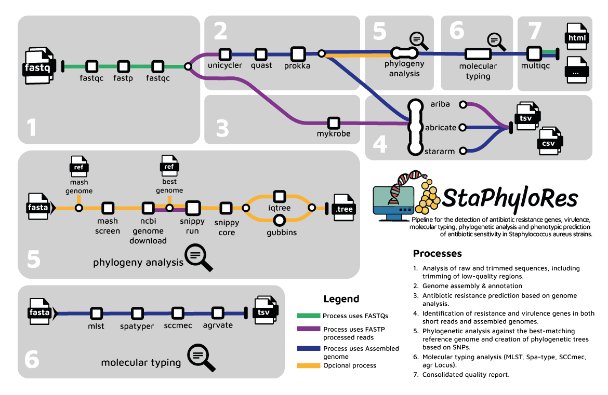

# 


# Introduccion

**StaPhyloRes** es un pipeline bioinformatico el cual permite realizar análisis de calidad de secuencias, ensamblaje, detección de genes de resistencia a antibióticos, virulencia, tipificación molecular, análisis filogenético y predicción fenotípica de sensibilidad antibiótica en cepas de *Staphylococcus aureus*.

El pipeline está construido usando [Nextflow](https://www.nextflow.io), una herramienta para ejecutar tareas en múltiples infraestructuras computacionales de manera muy portátil.

Este trabajo forma parte del Trabajo de Fin de Máster del Máster Universitario en Bioinformática de la Universidad Europea de Madrid.

<!-- TODO nf-core:
   Complete this sentence with a 2-3 sentence summary of what types of data the pipeline ingests, a brief overview of the
   major pipeline sections and the types of outpu t it produces. You're giving an overview to someone new
   to nf-core here, in 15-20 seconds. For an example, see https://github.com/nf-core/rnaseq/blob/master/README.md#introduction
-->

<!-- TODO nf-core: Include a figure that guides the user through the major workflow steps. Many nf-core
     workflows use the "tube map" design for that. See https://nf-co.re/docs/contributing/design_guidelines#examples for examples.   -->
<!-- TODO nf-core: Fill in short bullet-pointed list of the default steps in the pipeline -->

## Herramientas Usadas

| Proceso                       | Herramienta                                                                                            |
|-------------------------------|--------------------------------------------------------------------------------------------------------|
| Control de calidad de lecturas | [`FastQC`](https://www.bioinformatics.babraham.ac.uk/projects/fastqc/)                                |
| Ensamblaje de genomas          | [`Unicycler`](https://github.com/rrwick/Unicycler)                                                    |
| Anotación de genes             | [`Prokka`](https://github.com/tseemann/prokka)                                                        |
| Predicción de resistencia fenotípica          | [`Mykrobe`](https://github.com/Mykrobe-tools/mykrobe)                                  |
| Análisis de resistencia        | [`ARIBA`](https://github.com/sanger-pathogens/ariba), [`ABRICATE`](https://github.com/tseemann/abricate), [`STARARM`](https://github.com/phac-nml/staramr) |
| Filogenia                      | [`Snippy`](https://github.com/tseemann/snippy), [`IQTree`](http://www.iqtree.org/), [`Gubbins`](https://github.com/sanger-pathogens/gubbins) |
| Tipado Molecular               | [`MLST`](https://github.com/tseemann/mlst), [`Spatyper`](https://github.com/HCGB-IGTP/spaTyper), [`Staphopia SCCmec`](https://github.com/staphopia/staphopia-sccmec), [`AgrVATE`](https://github.com/VishnuRaghuram94/AgrVATE).
| Informes de calidad            | [`MultiQC`](http://multiqc.info/)

# Workflow



## Modo de Uso

> Nota: Si eres nuevo en Nextflow y nf-core, consulta [esta página](https://nf-co.re/docs/usage/installation) para configurar Nextflow. Asegúrate de [probar tu configuración](https://nf-co.re/docs/usage/introduction#how-to-run-a-pipeline) con  `-profile test` antes de ejecutar el pipeline con datos reales.

### Preparación de los Datos

Prepara una `samplesheet` con las secuencias `R1` y `R2`. El formato de la `samplesheet.csv` debe ser el siguiente:

```csv
sample,fastq_1,fastq_2
IDENTIFICADOR,XXXXXXX_XX_L002_R1_001.fastq.gz,XXXXXXX_XX_L002_R2_001.fastq.gz
```

Puedes utilizar el script incluido en la carpeta: `resourses` para crear esta samplesheet:

```bash
./Crear_CSV.bash inputdir/ samplesheet.csv
```

Cada fila representa un par de archivos fastq (paired end).

### Preparación del Entorno

Crear un entorno de **Conda** a partir del archivo YML proporcionado:

```bash
conda env create -f TFM-Resvirpredictor/resourses/resvirpredictor.yml --name env_name
```

Activa el entorno:

```bash
conda activate env_name
```

---

## **Ejecución Básica**

```bash
nextflow run TFM-Resvirpredictor/ --input samplesheet.csv --outdir outdirpath/
```

Este comando ejecutará el análisis, que incluye:

- Análisis de calidad de secuencias raw
- Trimado y análisis de calidad de secuencias trimadas
- Ensamblaje
- Análisis de calidad de ensamblados
- Búsqueda de genes de resistencia y virulencia en secuencias cortas y ensamblados
- Estudio MLST para Staphylococcus aureus
- Predicción de resistencia fenotípica basada en el análisis genómico
- Generación de informes consolidados

### Profiles disponibles:

#### **CONDA**
```bash
nextflow run TFM-Resvirpredictor/ --input samplesheet.csv --outdir outdirpath/ -profile conda
```

#### **DOCKER**
```bash
nextflow run TFM-Resvirpredictor/ --input samplesheet.csv --outdir outdirpath/ -profile docker
```

---

## **Análisis Opcionales y Complementarios**

### Uso de una Base de Datos Personalizada

El pipeline puede usar una base de datos personalizada, `"staph_vf.fasta"`, en el directorio `resources`. Para usarla:

1. Verifica la base de datos de Abricate:

```bash
abricate --datadir
```

2. Copia el archivo `staph_vf.fasta`:

```bash
cp TFM-Resvirpredictor/resources/staph_vf.fasta /pathtobd/staph/sequences

abricate --setupdb
```

3. Ejecuta el pipeline:

```bash
nextflow run TFM-Resvirpredictor/ --input samplesheet.csv --outdir outdirpath/ --abricate_db true
```

---

## **Estudio de Filogenia**
Descarga la base de datos de referencia MASH:

```bash
https://gembox.cbcb.umd.edu/mash/refseq.genomes.k21s1000.msh
```

Ejecuta el pipeline con la referencia de MASH:

```bash
nextflow run TFM-Resvirpredictor/ --input samplesheet.csv --outdir outdirpath/ --phylogeny true --mash_reference pathtomashreference.msh
```

---

## **Comandos**

### Input/Output Options

- `--input [string]`: Ruta al archivo CSV de muestras.
- `--outdir [string]`: Directorio de salida para los resultados.
- `--abricate_db [boolean]`: Utiliza una base de datos personalizada.
- `--gubbins [boolean]`: Alternativa a Snippy para el análisis filogenético.
- `--email [string]`: Dirección de correo electrónico para recibir un resumen de la finalización del pipeline.

### Skip Options

- `--skip_unicycler [boolean]`: Omite la ejecución de Unicycler.
- `--skip_ariba [boolean]`: Omite el análisis con ARIBA.
- `--skip_assemblyanalisis [boolean]`: Omite el análisis con Abricate y Staramr.
- `--skip_mykrobe [boolean]`: Omite el análisis con Mykrobe.
- `--skip_mlst [boolean]`: Omite el estudio MLST.

### Opciones para Estudio de Filogenia

- `--phylogeny [boolean]`:Activa el análisis filogenético. (Genoma de referencia obtenido de [aquí](https://gembox.cbcb.umd.edu/mash/refseq.genomes.k21s1000.msh)).
- `--mash_reference [string]`: Ruta a la referencia MASH.

### Opciones de Solicitud Máxima de Trabajos

- `--max_cpus [integer]`: Número máximo de CPUs que se pueden solicitar para cualquier trabajo individual. [default: 16]
- `--max_memory [string]`: Cantidad máxima de memoria que se puede solicitar para cualquier trabajo individual. [default: 12.GB]
- `--max_time [string]`: Tiempo máximo que se puede solicitar para cualquier trabajo individual. [default: 240.h]

### Opciones Genéricas

- `--help [boolean]`: Muestra el texto de ayuda.

### Cambiar el Directorio de Trabajo en la Línea de Comandos
  Puedes especificar un directorio de trabajo personalizado al ejecutar el pipeline usando la opción `-work-dir`.

```bash
nextflow run TFM-Resvirpredictor/ --input samplesheet.csv --outdir outdirpath/ -work-dir /path/to/custom/workdir
```

## **Resultados**
Para ver los resultados de una ejecución de prueba con un conjunto de datos de tamaño completo, consulta la carpeta [results](https://github.com/VictorPizarroR/StaPhyloRes/tree/master/results) contenida en esta pagina.

## **Créditos**

**StaPhyloRes** fue desarrollado por [Víctor Pizarro Riveros](https://github.com/VictorPizarroR) como parte de su Trabajo de Fin de Máster en Bioinformática de la Universidad Europea de Madrid.

Agradecimientos especiales a la comunidad [nf-core](https://nf-co.re) por proporcionar herramientas bajo la [licencia MIT](https://opensource.org/licenses/MIT).

## **Citations**

<!-- TODO nf-core: Add citation for pipeline after first release. Uncomment lines below and update Zenodo doi and badge at the top of this file. -->
<!-- If you use StaPhyloRes for your analysis, please cite it using the following doi: [10.5281/zenodo.XXXXXX](https://doi.org/10.5281/zenodo.XXXXXX) -->

<!-- TODO nf-core: Add bibliography of tools and data used in your pipeline -->

Una lista completa de referencias para las herramientas utilizadas por el pipeline se puede encontrar en el archivo  [`CITATIONS.md`](CITATIONS.md).

This pipeline uses code and infrastructure developed and maintained by the [nf-core](https://nf-co.re) initative, and reused here under the [MIT license](https://github.com/nf-core/tools/blob/master/LICENSE).

> The nf-core framework for community-curated bioinformatics pipelines.
>
> Philip Ewels, Alexander Peltzer, Sven Fillinger, Harshil Patel, Johannes Alneberg, Andreas Wilm, Maxime Ulysse Garcia, Paolo Di Tommaso & Sven Nahnsen.
>
> Nat Biotechnol. 2020 Feb 13. doi: 10.1038/s41587-020-0439-x.

In addition, references of tools and data used in this pipeline are as follows:
